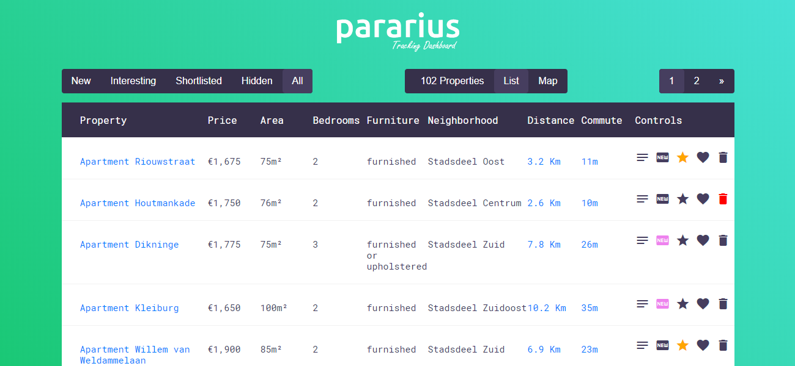
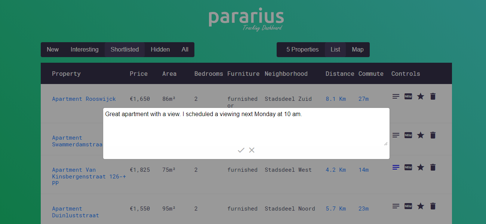

# Pararius Apartment Hunting Dashboard

I built this app to help me in my apartment hunt in Amsterdam. It scrapes Pararius.com for apartments that I'm interested in and populates a nice dashboard with the results where I can categorize them, compare them, add notes or see my daily commute time and distance for each listing.

## Features

- Scrap a Pararius URL every hour for new listings.
- Maintain a local database for all properties fetched so far.
- Add apartments to a new category automatically.
- Allow favoring, shortlisting or hiding properties.
- Allow saving text notes on each property.
- Calculate the daily commute time and distance to a specific address.
- Compares: price, surface area, bedrooms, whether it is furnished, neighborhood, distance, and compute time.
- Show a map for each category.

Still to come if I have time:

- Chrome notifications for new listings.
- Chrome notifications for shortlisted or interesting listings that are not available anymore.
- Sorting listing on various parameters. (especially the commute time and distance)

## Demo Screenshots






## Google APIs

In order for this app to work and show you maps, commute time, and distance, you need an API key from Google. You can get it for free after logging-in and enabling billing [here](https://console.cloud.google.com/google/maps-apis/overview). You should enable these three APIs for the key: Geocoding API, Maps JavaScript API, and Distance Matrix API.

You can then place the key in the config file. (See below)

## Configuration

You can configure different aspects for the app from the [config.js](config.js) file.

Note: since Pararius protected its site with fairlane, the process got a bit trickier. With the current implementation of this project using axios, the user has to first go to https://pararius.com and copy the cookies from the browser.

```
// We will parse the listings from this URL, open it in your browser first, adjust the filters and make sure it is in the list mode not the maps.
config.url = "https://www.pararius.com/apartments/amsterdam/1500-1900/75m2/2-bedrooms/furnished";

// Frequency of scraping and updates from Pararius in minutes. (Minimum: 15)
config.updateFrequency = 60;

// Used to calculate distance and commute time, can be any string. Please try it on Google maps first.
config.commuteAddress = "1011 DJ, Amsterdam"

// Used to calculate distance and commute time to commuteAddress. It can be: driving, walking, bicycling or transit. (transit calculate it as if you are commuting now)
config.commuteMode = "bicycling";

// Max results per page in the dashboard.
config.resultsPerPage = 20

// So as not to leech Pararius, a sane limit has to be in place.
config.maxScrapingResults = 500

// Maximum requests per second for Pararius.
config.googleApiMaxRequestPerSecond = 10

// Maximum requests per second for Google APIs.
config.googleApiMaxRequestPerSecond = 10

// Very important to calculate distance, coordinates, and displaying maps in the dashboard.
// These APIs have to be enabled on https://console.developers.google.com/: Geocoding API, Maps JavaScript API, and Distance Matrix API
config.googleApi = "GOOGLE_API_KEY"

// Insert your cookies from your browser session. This is used to bypass the "fairlane" protection.
config.cookies = "COOKIES_FROM_BROWSER"

// Where to serve the app
config.port = 8080
```

## Building And Running

_Install dependencies_:

```
npm i
```

_Start the dashboard_:

```
npm start
```

You can then go to `http://localhost:8080` to see the dashboard.

## Legal Notice

All product names, trademarks and registered trademarks of Pararius are property of their respective owners. All company, product and service names used here are for identification purposes only. I'm not by any means affiliated with them or claim any rights with respect to their website or their brand.

## License

```
The MIT License

Permission is hereby granted, free of charge, to any person obtaining a copy
of this software and associated documentation files (the "Software"), to deal
in the Software without restriction, including without limitation the rights
to use, copy, modify, merge, publish, distribute, sublicense, and/or sell
copies of the Software, and to permit persons to whom the Software is
furnished to do so, subject to the following conditions:

The above copyright notice and this permission notice shall be included in
all copies or substantial portions of the Software.

THE SOFTWARE IS PROVIDED "AS IS", WITHOUT WARRANTY OF ANY KIND, EXPRESS OR
IMPLIED, INCLUDING BUT NOT LIMITED TO THE WARRANTIES OF MERCHANTABILITY,
FITNESS FOR A PARTICULAR PURPOSE AND NONINFRINGEMENT. IN NO EVENT SHALL THE
AUTHORS OR COPYRIGHT HOLDERS BE LIABLE FOR ANY CLAIM, DAMAGES OR OTHER
LIABILITY, WHETHER IN AN ACTION OF CONTRACT, TORT OR OTHERWISE, ARISING FROM,
OUT OF OR IN CONNECTION WITH THE SOFTWARE OR THE USE OR OTHER DEALINGS IN
THE SOFTWARE.
```